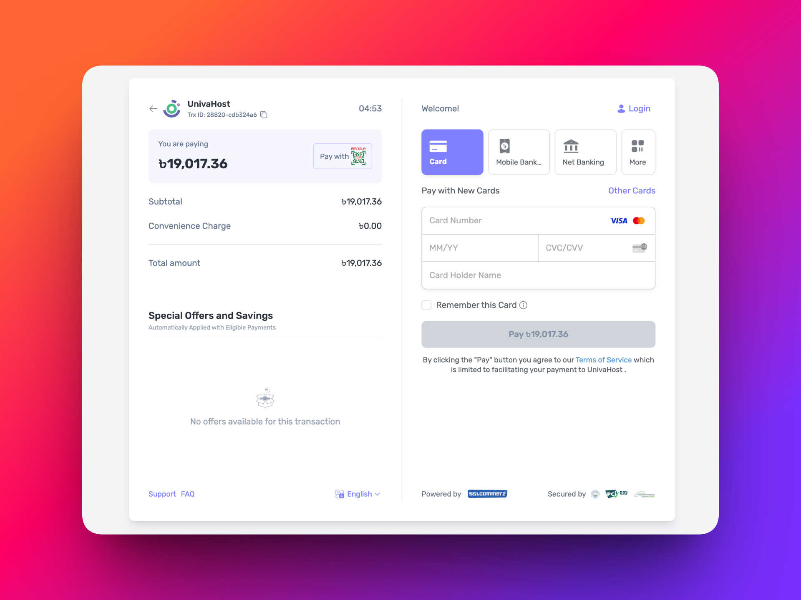

# SSLCommerz Payment Gateway for WHMCS

A modern, hardened SSLCommerz payment gateway integration for WHMCS — supports the redesigned `pay.sslcommerz.com` hosted checkout, embedded popup mode, full IPN with hash verification, refunds, and a polished branded loader UI.



---

## Features

- **Modern hosted checkout** — automatic URL rewriting to the redesigned `pay.sslcommerz.com` page
- **Two checkout flows**:
  - **Standard redirect** — user is taken to the SSLCommerz hosted page
  - **Embedded popup** — payment opens in an in-page iframe on desktop
- **Mobile-aware** — small screens automatically fall back to the redirect flow (the embed popup renders poorly on phones)
- **Branded loader UI** — animated dual-ring spinner with progress bar, trust signals, and brand colors, consistent across every flow
- **Full IPN support** with:
  - Hash signature verification (`verify_sign` + `verify_key` + store password MD5)
  - Server-to-server validator API call
  - Risk-level enforcement (rejects high-risk transactions)
  - Currency cross-check via `value_b` round-trip
  - Float-tolerant amount comparison
- **Refunds** from WHMCS Admin → Invoices → Refund (no Composer dependencies)
- **Random transaction-id suffix** — avoids duplicate-tran_id rejection on retries
- **Friendly error messages** with reason codes passed back to the invoice page
- **WHMCS 8+ MetaData** declaration (APIVersion 1.1)
- **Full TLS verification** + cURL timeouts on every outbound call
- **Capsule ORM** — no raw SQL, no Composer vendor bloat (~15 KB total)

---

## Requirements

- WHMCS 8.0 or higher
- PHP 7.4 or higher (uses `random_bytes`, null-coalescing, typed arrays)
- An active SSLCommerz merchant account (Store ID + API Password)
- HTTPS on your WHMCS install (required by SSLCommerz)

---

## Installation

### Option A — Drop-in (recommended)

1. Download or clone this repository.
2. Copy the `modules/` folder into your WHMCS root, merging with the existing `modules/` directory.

```
modules/gateways/sslcommerz.php
modules/gateways/callback/sslcommerz.php
modules/gateways/callback/sslcommerz_ipn.php
modules/gateways/sslcommerz/sslcommerz_logo.png
modules/gateways/sslcommerz/whmcs.json
```

3. Set file permissions (`644` for files, `755` for directories; owner = your webserver user).
4. Clear WHMCS template cache: delete the contents of `templates_c/` (keep the folder).

### Option B — From the release zip

1. Download the latest release `.zip`.
2. Extract its `modules/` folder into the WHMCS root.
3. Same permissions and cache-clear steps as above.

---

## Configuration

### 1. Activate the gateway

Open **Admin → System Settings → Payment Gateways → All Payment Gateways**, find **SSLCommerz**, and click **Activate**.

### 2. Fill in the settings

| Field | What it does |
|---|---|
| **Merchant Store ID** | Your SSLCommerz merchant account identifier |
| **Merchant API Password** | API credential issued by SSLCommerz |
| **Sandbox Mode** | Routes transactions through the SSLCommerz test environment (no real charges) |
| **Pay Button Text** | The wording shown on the invoice's pay button (default: `Pay Now`) |
| **Embedded Checkout Popup** | Opens payment in an in-page iframe popup on desktop. Mobile auto-falls back to redirect for usability |
| **Modern Hosted Page** | Forces every redirect through `pay.sslcommerz.com` (the rebuilt UI). Recommended for production |

### 3. Configure the IPN URL

In your **SSLCommerz Merchant Panel**, set the IPN URL to:

```
https://yourdomain.com/modules/gateways/callback/sslcommerz_ipn.php
```

Without this, payment captures will rely solely on the user returning to your site.

---

## How it works

### Standard redirect flow

```
[Customer]
    ↓ clicks Pay Now
[WHMCS invoice page]
    ↓ AJAX POST → sslcommerz_link()
[Module creates payment session via SSLCommerz API]
    ↓ returns GatewayPageURL (rewritten to pay.sslcommerz.com if enabled)
[Browser redirects to hosted checkout]
    ↓ customer completes payment
[SSLCommerz fires IPN]  ───→  [sslcommerz_ipn.php]
    ↓                              ↓ verify hash, validator API,
[Customer redirected back]         risk, amount, currency
    ↓                              ↓
[viewinvoice.php?paymentsuccess=true]   [addInvoicePayment()]
```

### Embedded popup flow (desktop)

Same as above, except `embed.min.js` mounts the SSLCommerz hosted page inside an iframe popup on your invoice page. The module styles it as a wide centered modal with a dim backdrop and adds a close button (Esc-key supported).

### Mobile fallback

When `Embedded Checkout Popup` is enabled and the user is on a screen ≤ 768 px wide, the click handler skips the embed loader entirely and uses the standard redirect flow. This avoids known rendering issues with SSLCommerz's embed iframe on small viewports.

---

## Security

| Layer | Mechanism |
|---|---|
| Transport | TLS verification (`VERIFYPEER` + `VERIFYHOST=2`) on every cURL |
| IPN authenticity | `verify_sign` checked against `md5(sorted_fields + md5(store_passwd))` |
| Replay protection | `checkCbTransID()` on `bank_tran_id` — duplicates rejected |
| Amount tampering | Validator-reported amount compared against `tblinvoices.total` (float, ±0.01 tolerance) |
| Currency tampering | Validator currency compared against `value_b` round-trip |
| Risk filtering | SSLCommerz `risk_level == 1` (high) automatically rejected |
| SQL safety | All DB access via WHMCS Capsule (parameterized) |
| XSS | All rendered values pass through `htmlspecialchars` (only on HTML, never on outbound API payloads) |
| Direct access | All callback files require POST + valid invoice id |
| Auth gating | AJAX session-create endpoint runs inside `viewinvoice.php`, which WHMCS gates by invoice ownership |

---

## Refunds

Click **Refund** from any paid invoice in the WHMCS admin. The module calls SSLCommerz's refund API directly via cURL — no Composer dependencies required.

Returns one of:
- `success` — refund accepted (status: `success`, `initiated`, or `processing`)
- `error` — non-200 HTTP, transport error, or non-success status

Full SSLCommerz response is stored as raw data in the WHMCS Gateway Log for audit.

---

## Failure reason codes

When a payment fails, the user is redirected to `viewinvoice.php?paymentfailed=true&reason=<code>`. You can read these codes in your invoice template via the `sslcommerz_error_messages()` helper:

| Code | Meaning |
|---|---|
| `underpaid` | Less than invoice total was paid |
| `duplicate` | Same payment was already processed |
| `gateway-bad` | Provider returned an unexpected response |
| `incomplete` | User left the payment flow without completing |
| `user-cancel` | User cancelled |
| `declined` | Card/MFS declined |
| `unknown` | Unclassified error |
| `amount-mismatch` | IPN amount didn't match invoice |
| `high-risk` | Transaction flagged as high-risk |

---

## Troubleshooting

### Gateway disappears from Payment Gateways list
- Verify `modules/gateways/sslcommerz/whmcs.json` exists and contains `"name": "sslcommerz"` (lowercase, matching the file name).
- Clear template cache: `rm -rf templates_c/*`.

### Activation page shows blank or 500
- Run `php -l modules/gateways/sslcommerz.php` to confirm syntax.
- Check your PHP error log (varies by host).
- Confirm PHP ≥ 7.4 (uses `random_bytes` and `??` null-coalescing).

### Payment succeeds at SSLCommerz but invoice stays unpaid
- Confirm IPN URL in your SSLCommerz merchant panel is exactly `https://yourdomain.com/modules/gateways/callback/sslcommerz_ipn.php`.
- Check **Admin → Utilities → Logs → Gateway Log** for entries like `Unsuccessful - Hash Mismatch` or `Unsuccessful - Validator Unreachable` — these tell you exactly which check failed.
- Confirm Store ID + API Password are entered correctly in gateway settings.

### Pay button does nothing
- Open browser DevTools → Console while clicking. Most common cause is a CDN-blocked SweetAlert2 — the module falls back to a native `alert()` and direct redirect, but a corporate firewall can sometimes block the fetch too.

### Popup looks broken on mobile
- The mobile auto-fallback should redirect instead of opening the popup. If you're seeing the popup on mobile, hard-refresh (Cmd+Shift+R) to clear cached JS.

### OPcache warning in WHMCS health check
- WHMCS recommends disabling OPcache. Edit `php.ini` (or your CLI php.ini for FPM) and set `opcache.enable=0`, then restart PHP-FPM.

---

## Differences from the official SSLCommerz module

This module was built independently. Compared to other community modules:

| Capability | This module | Typical alternatives |
|---|---|---|
| IPN with hash verification | ✅ | ❌ (return URL only — risky if user closes tab) |
| Random tran_id suffix (retry-safe) | ✅ | ❌ (uses `uniqid()`, predictable) |
| Risk-level enforcement | ✅ | ❌ |
| Currency cross-check | ✅ | ❌ |
| Branded loader UI | ✅ | ❌ |
| Mobile redirect fallback | ✅ | ❌ |
| Refunds | ✅ (plain cURL) | ✅ (often via Composer/Guzzle) |
| Composer dependencies | None | Often Guzzle + Symfony |
| Total module size | ~25 KB | Typically several MB |

---

## Development

### File layout

```
modules/gateways/
├── sslcommerz.php                      # main module (config, link handler, refund, MetaData)
├── callback/
│   ├── sslcommerz.php                  # browser return handler (303 redirect)
│   └── sslcommerz_ipn.php              # server-to-server IPN (hash + validator)
└── sslcommerz/
    ├── sslcommerz_logo.png             # logo shown in WHMCS admin
    └── whmcs.json                      # WHMCS marketplace metadata
```

### Lint check

```bash
php -l modules/gateways/sslcommerz.php
php -l modules/gateways/callback/sslcommerz.php
php -l modules/gateways/callback/sslcommerz_ipn.php
```

### Test transactions

Sandbox credentials available from <https://developer.sslcommerz.com>. Toggle **Sandbox Mode** in the gateway settings to route through the test environment.

---

## License

MIT — see [LICENSE](LICENSE).

---

## Support

This is a community-maintained integration. For issues, open a GitHub issue with:
- WHMCS version
- PHP version
- The exact log line from **Admin → Utilities → Logs → Gateway Log** for the failing transaction
- Screenshot of the gateway settings (with credentials redacted)
